## API REST – Gestión de Productos
**Alumno:** Rodrigo Angel Zonca Calise
**Legajo:** 51164
**Materia:** Desarrollo de Software  
**Carrera:** Ingenieria en Sistemas de Informacion (UTN)
---

## Descripción del proyecto

Este proyecto consiste en una **API REST completa y profesional** desarrollada con **Spring Boot 3**, para la **gestión de productos** de un e-commerce.  
Implementa arquitectura en capas, validaciones, manejo centralizado de excepciones, persistencia con **Spring Data JPA y H2**, y documentación con **Swagger/OpenAPI**.

El objetivo es demostrar la correcta aplicación de los principios REST y las buenas prácticas de desarrollo backend en Java.

---

## ⚙️ Tecnologías utilizadas

| Tecnología | Descripción |
|-------------|-------------|
| **Java 17** | Lenguaje principal |
| **Spring Boot 3.x** | Framework base del proyecto |
| **Spring Web** | Exposición de controladores REST |
| **Spring Data JPA** | Persistencia de datos |
| **H2 Database** | Base de datos en memoria para pruebas |
| **Validation (Jakarta)** | Validaciones declarativas con anotaciones |
| **Lombok** | Simplificación del código con anotaciones |
| **Springdoc OpenAPI / Swagger UI** | Documentación interactiva de la API |

---

## Instrucciones para clonar y ejecutar

1. **Clonar el repositorio**
   ```bash
   git clone https://github.com/<tu_usuario>/productos-api.git
   cd productos-api
   ```

2. **Compilar y ejecutar**
   ```bash
   mvn spring-boot:run
   ```
   > Requiere **Java 17+** y **Maven 3.9+** instalados.

3. **Acceder a las herramientas**
    - Swagger UI → [http://localhost:8080/swagger-ui.html](http://localhost:8080/swagger-ui.html)
    - Documentación OpenAPI → [http://localhost:8080/api-docs](http://localhost:8080/api-docs)
    - Consola H2 → [http://localhost:8080/h2-console](http://localhost:8080/h2-console)
        - JDBC URL: `jdbc:h2:mem:productosdb`
        - User: `sa`
        - Password: *(vacío)*

---

## 🌐 Endpoints principales

| Método | Ruta | Descripción | Código esperado |
|:------:|:-----|:-------------|:----------------|
| **GET** | `/api/productos` | Listar todos los productos | 200 OK |
| **GET** | `/api/productos/{id}` | Obtener producto por ID | 200 / 404 |
| **GET** | `/api/productos/categoria/{categoria}` | Filtrar por categoría | 200 OK |
| **POST** | `/api/productos` | Crear un producto nuevo (valida DTO) | 201 Created |
| **PUT** | `/api/productos/{id}` | Actualizar un producto completo | 200 OK |
| **PATCH** | `/api/productos/{id}/stock` | Actualizar solo el stock | 200 OK |
| **DELETE** | `/api/productos/{id}` | Eliminar producto por ID | 204 No Content |

---

## Casos de prueba solicitados (para las capturas)

### Documentación Swagger
📸 *Captura de pantalla de Swagger UI mostrando todos los endpoints.*

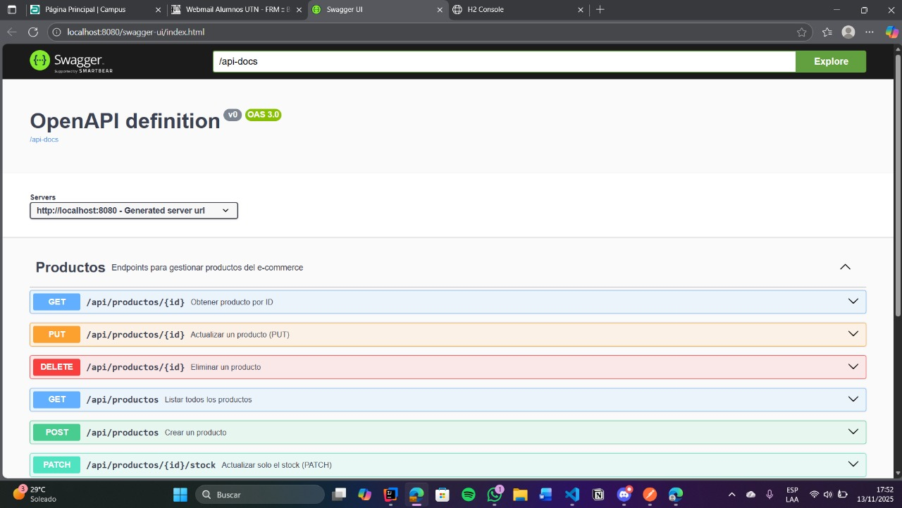

---

### POST – Crear producto exitosamente
**Body ejemplo:**
```json
{
  "nombre": "Mouse Inalámbrico Pro",
  "descripcion": "Bluetooth 5.0, 16000 DPI",
  "precio": 59999.90,
  "stock": 20,
  "categoria": "ELECTRONICA"
}
```
📸 *Captura del 201 Created con el JSON de respuesta.*

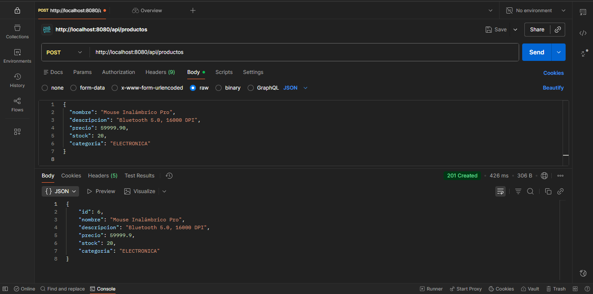

---

### GET – Listar productos
📸 *Captura del listado con todos los productos del `data.sql` + el nuevo creado.*
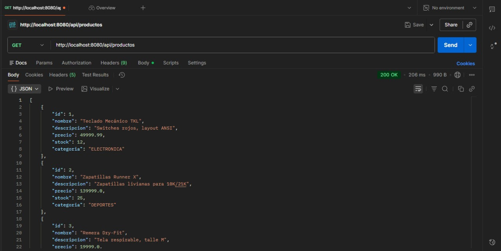
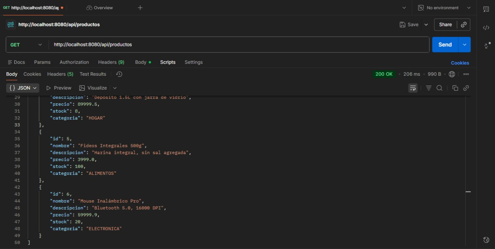

---

### GET – Producto por ID
📸 *Captura de una búsqueda exitosa por ID (200 OK).*
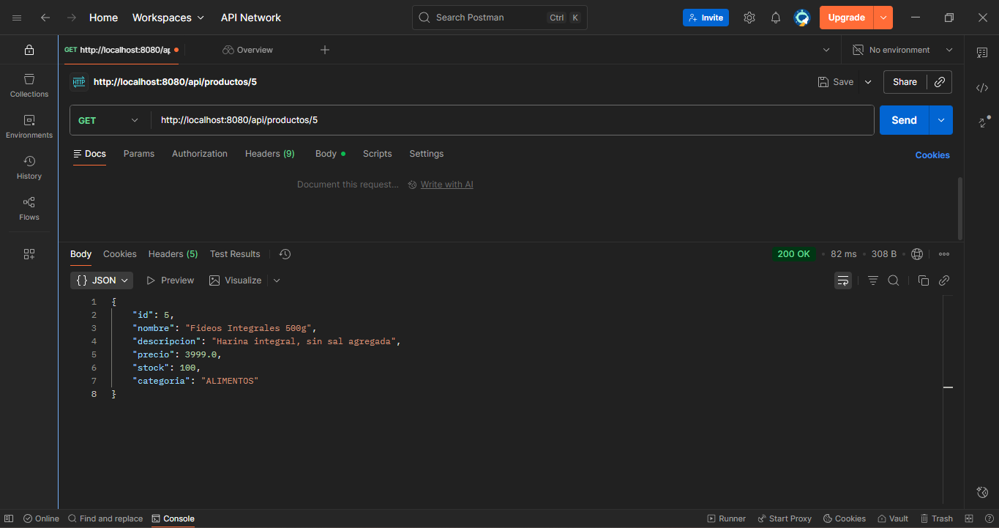

---

### GET – Producto no encontrado (404)
📸 *Captura del error 404 con el mensaje `"Producto con id X no encontrado"`.*
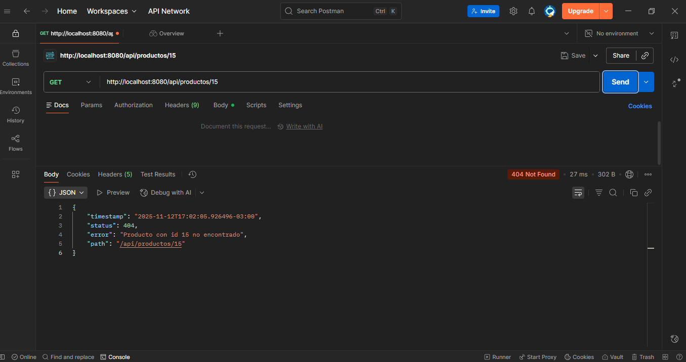

---

### POST – Error de validación (400)
**Body inválido ejemplo:**
```json
{
  "nombre": "",
  "descripcion": "x",
  "precio": 0,
  "stock": -1,
  "categoria": null
}
```
📸 *Captura mostrando el 400 Bad Request con errores por campo.*
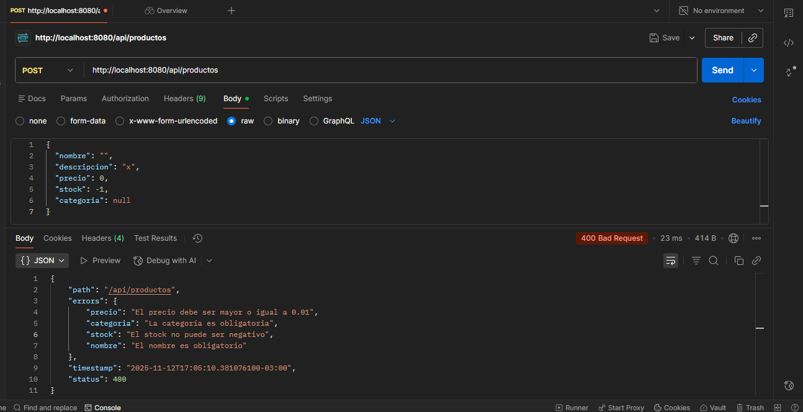

---

### PUT – Actualización completa
📸 *Captura del 200 OK luego de actualizar todos los campos.*
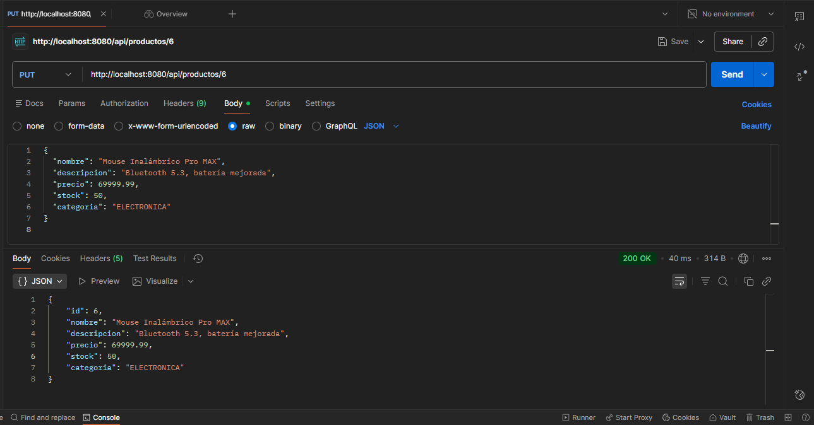

---

### PATCH – Actualización de stock
📸 *Captura del 200 OK mostrando solo el cambio en el stock.*
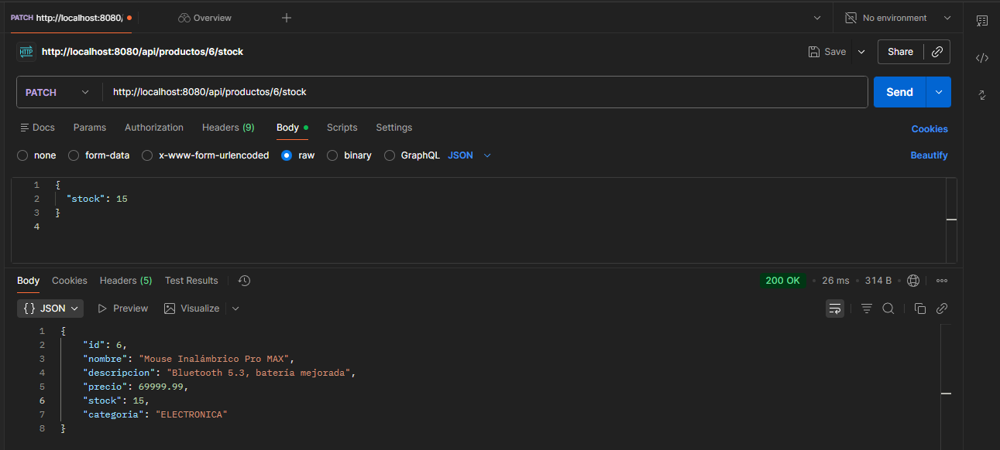

---

### DELETE – Eliminación de producto
📸 *Captura del 204 No Content y luego del 404 al intentar obtenerlo.*
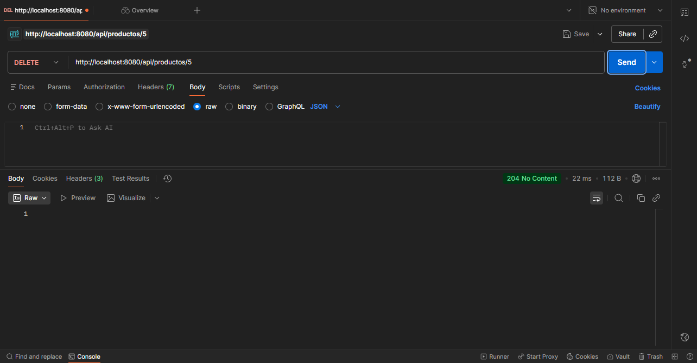
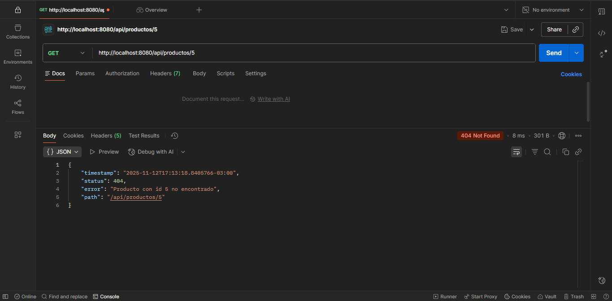

---

### Consola H2
📸 *Captura del resultado de `SELECT * FROM PRODUCTO;` mostrando los datos cargados.*
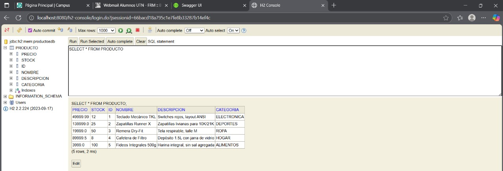

---

## 🔗 Instrucciones adicionales

- Para ver los logs SQL en consola:
  ```properties
  spring.jpa.show-sql=true
  spring.jpa.properties.hibernate.format_sql=true
  ```
- Si `data.sql` falla al inicio, verificar que esté configurado:
  ```properties
  spring.jpa.defer-datasource-initialization=true
  spring.sql.init.mode=always
  ```
---

## 👤 Autor

**Rodrigo Angel Zonca Calise**  
Legajo: **51164**  
 Año: **2025**  
 Universidad Tecnológica Nacional (UTN) – Desarrollo de SW


